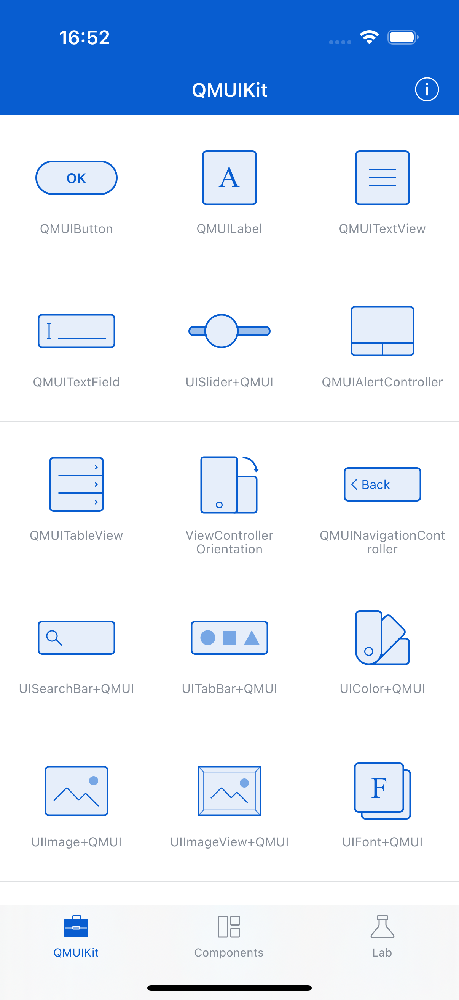

# Dialog

**Component:** `QMUIDialogViewController`
**Category:** Alerts & Dialogs

## Description

A highly customizable dialog view controller for displaying alerts, confirmations, and input dialogs. Extends QMUIModalPresentationViewController with built-in button handling and content layouts.

## Features

- Multiple button layouts (horizontal, vertical)
- Text input support
- Custom content view support
- Automatic keyboard handling
- Theme-aware styling

## Screenshot



## Usage

```objc
// See QMUIDemo for implementation examples
```

## Test Automation

This component is covered by UI tests in `QDScreenshotTests.m`.

---
*Generated: 2025-12-24*
