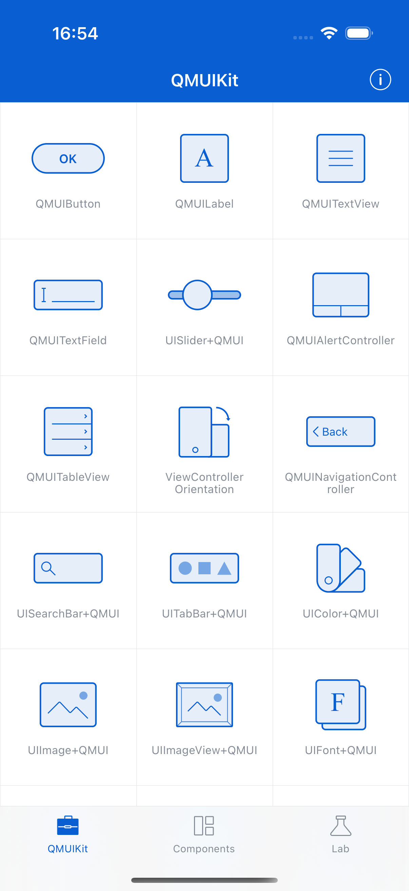

# Marquee Label

**Component:** `QMUIMarqueeLabel`
**Category:** Text

## Description

A scrolling label that automatically animates text that exceeds the label bounds. Includes fade edges and speed control.

## Features

- Automatic scrolling
- Edge fade effect
- Configurable speed
- Pause on touch

## Screenshot



## Usage

```objc
// See QMUIDemo for implementation examples
```

## Test Automation

This component is covered by UI tests in `QDScreenshotTests.m`.

---
*Generated: 2025-12-24*
