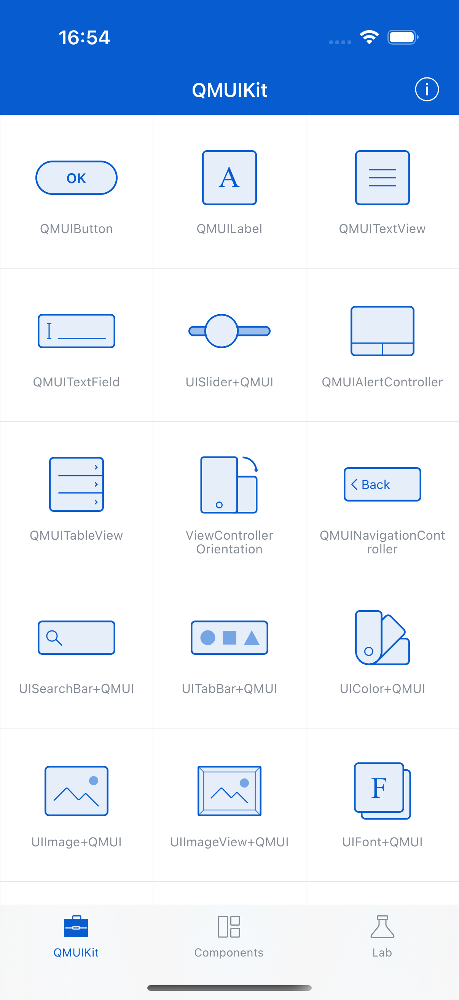

# Multiple Delegates

**Component:** `QMUIMultipleDelegates`
**Category:** Utilities

## Description

A utility allowing multiple objects to receive delegate callbacks. Useful for decoupling components that need to observe the same delegate.

## Features

- Multiple delegate registration
- Automatic cleanup of deallocated delegates
- Protocol-based forwarding

## Screenshot



## Usage

```objc
// See QMUIDemo for implementation examples
```

## Test Automation

This component is covered by UI tests in `QDScreenshotTests.m`.

---
*Generated: 2025-12-24*
