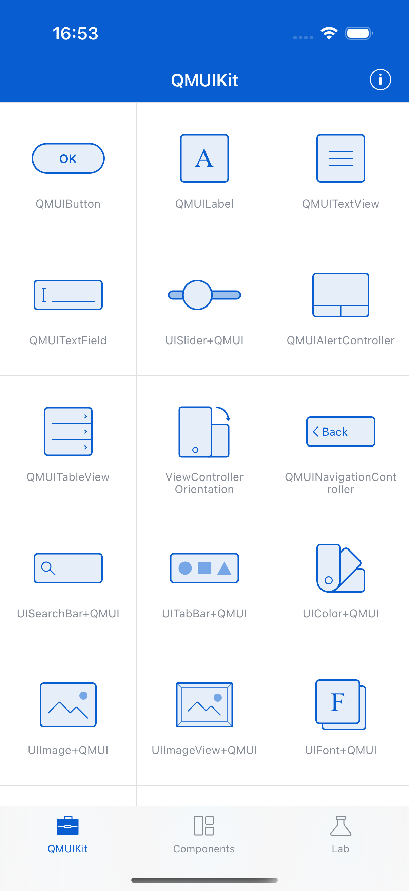

# Grid View

**Component:** `QMUIGridView`
**Category:** Layout

## Description

A simple grid layout view for displaying items in rows and columns. Handles separator lines and equal-width item distribution.

## Features

- Configurable columns
- Automatic row creation
- Separator lines
- Equal width distribution

## Screenshot



## Usage

```objc
// See QMUIDemo for implementation examples
```

## Test Automation

This component is covered by UI tests in `QDScreenshotTests.m`.

---
*Generated: 2025-12-24*
