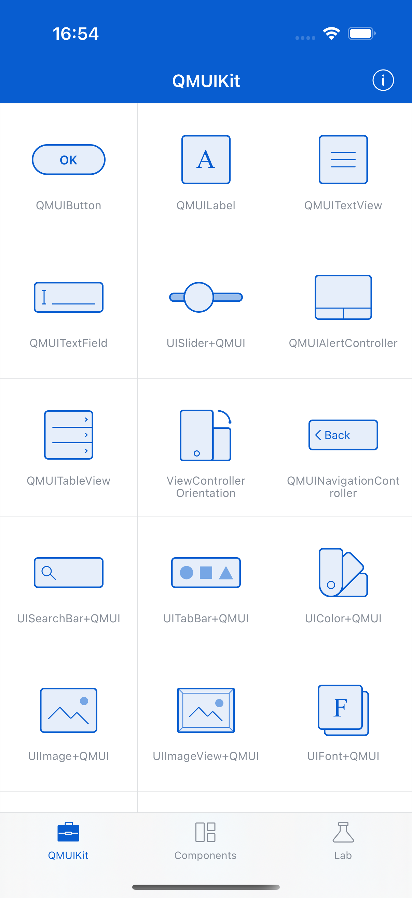

# Keyboard Manager

**Component:** `QMUIKeyboardManager`
**Category:** Input

## Description

A keyboard appearance manager that handles keyboard show/hide events, content inset adjustments, and toolbar accessories.

## Features

- Keyboard event handling
- Automatic scroll view adjustment
- Toolbar accessory support
- Multi-responder support

## Screenshot



## Usage

```objc
// See QMUIDemo for implementation examples
```

## Test Automation

This component is covered by UI tests in `QDScreenshotTests.m`.

---
*Generated: 2025-12-24*
